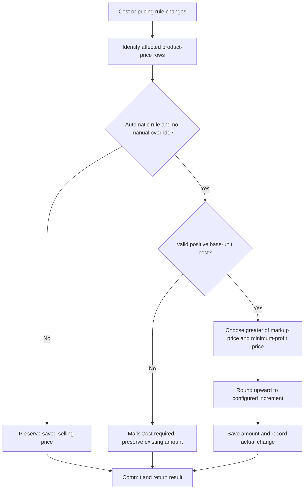

# Product Automatic Pricing — Feature Specification

Version: 1.0 | Date: 2026-09-07 | Purpose: implementation in another application

## 1. Purpose and scope

Automatically calculate product selling prices from buying cost using a configurable markup, minimum profit, and upward rounding. Support multiple price types (for example Retail, Wholesale, and Credit) and a manual override for each product and price type.

This specification is based on MKPOS source code. Sections 2–10 define the intended implementation contract for the receiving app, including recommended improvements. Section 11 identifies differences from the current implementation so that recommendations are not mistaken for existing functionality.

Included: price-rule configuration, product pricing, purchase-driven recalculation, explicit application to existing products, validation, feedback, and integration requirements.

Excluded: promotions, scheduled pricing, competitor pricing, tax calculation, exchange rates, weighted-average inventory costing, and automatic changes to completed sales. Minimum profit here is selling price minus buying cost, before other business expenses.

## 2. Concepts and permissions

| Concept | Meaning |
| --- | --- |
| Price type | Named selling-price tier with one shared pricing rule. |
| Automatic rule | Defines markup percentage, minimum profit amount, and rounding increment. |
| Manual product price | User-entered amount protected from routine recalculation. |
| Automatic product price | Follows its price type's automatic rule and current buying cost. |
| Base unit | Smallest configured inventory unit; cost and calculated prices use this unit. |
| Latest buying cost | Effective base-unit cost from the latest eligible completed purchase, otherwise the product's opening/base cost. |

Recommended permission split: authorized managers configure rules and apply them in bulk; product editors change product prices and overrides; purchasing staff trigger recalculation by saving purchases; sales staff consume current prices. Enforce permissions and business/tenant isolation on the server. MKPOS currently uses the products module permission for rule writes.

## 3. Pricing rules

### 3.1 Rule fields

| Field | Input and default | Validation |
| --- | --- | --- |
| Name | Required text, e.g. Retail | Trimmed, 1–50 characters; unique ignoring case within the business; reject comma, forward slash, and backslash for MKPOS compatibility. |
| Pricing mode | Manual / Automatic; default Manual | Only these two values. |
| Markup % | Number; default 0 | 0–1000 inclusive; support decimal percentages. |
| Round up to | Money increment; default 1 | Positive integer, 1–100000 for MKPOS compatibility. Presets: 1, 10, 50, 100, 500, 1000. |
| Minimum profit | Money amount; default 0 | Nonnegative integer in MKPOS money units. |
| Apply to existing products | Unchecked checkbox | A command for this save, never a persistent rule preference. Only applicable to Automatic. |

For another currency, use integer minor units or fixed-decimal money consistently. Label amounts with the selected business currency; MKPOS uses whole Ks. Do not silently interpret rounding increments as a different money unit.

### 3.2 Formula

For a valid positive base-unit cost:

```text
C = current buying cost per base unit
M = markup percentage
P = minimum profit amount per base unit
R = upward rounding increment

markup_price = C × (1 + M / 100)
minimum_price = C + P
selling_price = ceil(max(markup_price, minimum_price) / R) × R
profit_amount = selling_price - C
markup_actual_percent = profit_amount / C × 100
```

Markup is a percentage of cost. It is not gross margin as a percentage of selling price. Minimum profit is a floor, not an extra amount added after markup. Round upward only after selecting the larger candidate; an exact multiple stays unchanged.

| Cost | Markup | Minimum profit | Round up | Result | Explanation |
| ---: | ---: | ---: | ---: | ---: | --- |
| 950 | 20% | 100 | 50 | 1150 | max(1140, 1050), rounded upward. |
| 1000 | 10% | 300 | 100 | 1300 | Minimum profit wins. |
| 1000 | 20% | 0 | 100 | 1200 | Already an exact multiple. |
| 1050 | 0% | 0 | 100 | 1100 | Rounding alone can increase profit. |

Recommended zero/missing-cost policy: mark automatic pricing as “Cost required,” retain an existing saved amount, and do not generate a replacement price. A new automatic row remains unavailable for sale until it has a valid cost or is changed to Manual with an explicit price. This resolves the current zero-cost inconsistency described in section 11.

### 3.3 Override and transition rules

Calculate only when the price type is Automatic and the product price has `is_manual = false`.

| Action | Required outcome |
| --- | --- |
| Create product | Automatic types default to Auto; manual types require manual entry. |
| Edit existing product | Preserve each saved override; newly introduced rows default to Manual for compatibility. |
| Auto → Manual on a product | Keep the displayed calculated amount as the initial editable value; future cost/rule updates leave it alone. |
| Manual → Auto on a product | Preview and save the current calculation; manual amount is replaced. |
| Edit an automatic rule without bulk apply | Recalculate rows already following that rule; preserve manual overrides. |
| Manual rule → Automatic, without bulk apply | Existing manual rows stay manual; new products may default to Auto. |
| Automatic rule → Manual | Preserve amounts and mark associated rows manual. |
| Save with bulk apply | For this price type, enroll all active products in Auto, including manual overrides and missing rows, then calculate where cost is valid. |
| Rename a price type | Preserve its rule, product amounts, and override flags. |

Both cost increases and decreases can change automatic prices. There is no “increase only” restriction.

## 4. UX specification

### 4.1 Settings → Prices

Display one row/card per type with name, Manual/Automatic badge, rule summary, active-product usage count, and Edit/Delete actions. Show an Add price type action. Example summary: “20% markup · minimum profit 100 Ks · round up to 50 Ks.”

Use a table on desktop and stacked cards on mobile. Mobile create/edit forms use separate full-page routes with Back, Cancel, and Save actions. Long lists should support incremental loading; maintain search and scroll position after editing.

Disable Delete when the type is in use or is the last remaining type, with a visible explanation. For the new app, count any active product association as use, including zero-priced rows. Confirm deletion of eligible unused types.

### 4.2 Create/edit rule form

Field order: Name → Pricing mode → Markup % → Round up to → Minimum profit → Preview → Apply to existing products (when applicable) → actions.

Disable numeric rule controls in Manual mode. In Automatic mode show helper text:

> Automatic prices use the latest buying cost. Prices round upward to preserve the configured profit. Product prices set to Manual stay unchanged unless you apply this rule to existing products.

Recommended interactive preview: an editable sample buying cost, markup candidate, minimum-profit candidate, final selling price, and resulting profit. Preview input does not change inventory cost.

```text
Edit price type: Retail
Pricing mode       [Automatic v]
Markup %           [20        ]
Round up to        [50 Ks    v]
Minimum profit     [100       ] Ks

Sample buying cost [950       ] Ks / Unit
Markup price:       1,140 Ks
Profit-floor price: 1,050 Ks
Final price:        1,150 Ks
Profit:               200 Ks

[ ] Apply to existing products
    Replaces manual overrides for this price type on all active products.

[Cancel]                         [Save price type]
```

When bulk apply is checked, show a review before committing: affected active products, automatic rows, manual overrides to replace, missing rows to add, and products without valid cost. Provide “Back to edit” and “Apply and save.” This is recommended UX for the receiving app; the current implementation does not provide this impact review.

Even without bulk apply, explain that saving rule changes immediately updates products already in Auto.

### 4.3 Product create/edit → Selling prices

Show buying cost and its base-unit label, followed by one price row per type. Each row shows type name, Auto/Manual selector when the shared rule allows automatic pricing, selling amount, and profit amount. An Auto amount is read-only and previews immediately when cost changes. A Manual amount is editable. Show “Manage rules in Settings → Prices” where the user has access.

Warn visibly when a positive manual price is below positive cost. Do not communicate the warning through color alone. Switching to Auto should show the replacement amount before saving. Cancel discards unsaved mode and amount changes.

### 4.4 Purchase entry and results

Show paid quantity, free-of-charge quantity, purchase unit, conversion factor, unit cost, and effective cost per base unit. Before saving, compare the effective cost with manual selling prices and identify any below-cost rows.

Warning actions: “Review items” and “Save anyway,” subject to the receiving app's purchasing permissions. Automatic rows are recalculated and should not be presented as unchanged manual-price losses.

After commit, show “Purchase saved. 3 automatic prices updated.” Count changed product-price rows, not products. Recommended detail view: product, type, old price, new price, and cost used. An unchanged calculation contributes no change count.

### 4.5 Common states and accessibility

Show loading placeholders while fetching settings; prevent submission until required rule data is available. Keep form values after validation/network errors. Place field errors beside controls, announce general errors and success messages, and prevent duplicate submissions while saving. Provide Retry on failed reads. Use explicit labels, keyboard navigation, visible focus, adequate contrast, and mobile touch targets of at least 44 CSS pixels. Announce calculated preview changes without moving focus.

## 5. Operating flows

### A. First-time setup

1. Manager opens Settings → Prices and creates or edits Retail.
2. Selects Automatic, enters markup, minimum profit, and rounding.
3. Checks the sample calculation.
4. Leaves bulk apply unchecked to preserve existing manual prices, or reviews and confirms bulk application.
5. Server validates, saves the rule, recalculates eligible rows, and returns a result summary.
6. New products use the automatic rule by default.

### B. Product exception

1. Product editor opens an existing product and selects Manual for Wholesale.
2. Enters the negotiated amount and saves.
3. Subsequent purchase and rule updates preserve that Wholesale amount; other automatic tiers continue updating.
4. To rejoin the rule, selects Auto, reviews the preview, and saves.

### C. Purchase changes cost

1. Purchasing staff select products and enter quantities, free units, costs, and units.
2. App calculates effective base-unit costs and previews manual-price warnings.
3. Staff resolve or acknowledge warnings and save.
4. Server saves purchase/stock changes, determines each affected product's current cost, recalculates eligible prices, and commits atomically.
5. App displays final committed changes and refreshes product/sales price caches.

### D. Edit/delete a purchase

1. Authorized staff edit or remove a purchase using the host app's normal workflow.
2. Server identifies all affected products, including products removed from edited lines.
3. Determines the latest remaining eligible completed purchase for each product; falls back to opening/base cost if none remains.
4. Recalculates automatic prices and returns changes from before the operation to the final committed state.
5. Historical completed sales retain their saved line prices.



## 6. Buying-cost calculation and event contract

```text
line_total = paid_quantity × purchase_unit_cost
received_base_quantity = (paid_quantity + free_quantity) × conversion_factor
effective_base_unit_cost = line_total / received_base_quantity
```

Quantities must use the same purchase unit before conversion. Paid quantity and conversion factor must be positive; free quantity and cost must be nonnegative. MKPOS rounds line totals and persisted product costs to whole currency units and base quantities to three decimals. Match that precision when compatibility is required.

Example: buy 10 boxes at 12,000 Ks per box, receive 2 free boxes, with 12 units per box. Total cost is 120,000 Ks and received quantity is 144 units. Effective cost is 833.333… Ks per unit; MKPOS stores 833 Ks. At 20% markup and rounding 50, the price becomes 1,000 Ks.

Recommended deterministic latest-cost policy: select the latest completed purchase by creation timestamp, then purchase ID. If a product appears multiple times in that purchase, use the largest line ID as the final line. Preserve creation order during edits. Recompute from this source after every purchase mutation; do not let an older edited purchase supersede a newer purchase accidentally.

| Trigger | Rows to evaluate |
| --- | --- |
| Product create/edit or direct cost change | Automatic rows on that product; calculate on server before saving. |
| Purchase create/edit/delete | Automatic rows for all affected products after final cost resolution. |
| Automatic rule edit | Existing automatic rows for that type. |
| Explicit bulk apply | All active products for the selected type, replacing overrides as reviewed. |
| Product Manual → Auto | Selected product/type row. |
| Sale or sale discount | No catalog price recalculation. |

## 7. Data and service design

Recommended entities:

| Entity | Required data |
| --- | --- |
| PriceTypeRule | Stable ID, business ID, name, pricing mode, markup percentage, rounding increment, minimum profit, version, timestamps. |
| Product | ID, business ID, base unit, opening/base cost, current cost, cost-source reference, active status. |
| ProductPrice | Product ID, price-type ID, amount, is_manual, calculation status, applied rule version, timestamp; unique product/type pair. |
| PriceChange (recommended) | Product/type, old/new amount, cost used, rule snapshot/version, trigger, actor, source operation, timestamp. |

Use stable type IDs in the new app so a rename does not change identity. If the app keeps a primary price on Product, define an explicit primary price-type ID and update its cached amount in the same transaction.

Implement one server calculation service used by every trigger. Client calculations provide previews only. Use decimal arithmetic or integer/rational calculations to prevent floating-point rounding errors. Validate amount limits before persistence. Lock affected records or use optimistic versions so concurrent rule, cost, and manual-override edits cannot silently overwrite one another. Roll back the business operation if its synchronous pricing update fails.

For large catalogs, bulk application may use a tracked background job with a fixed rule version, progress, failure reporting, and retry-safe batches. If this is implemented, distinguish pending from completed prices in the UI; do not announce completion before the job finishes.

## 8. API contract

Existing MKPOS endpoints, relative to the API base:

| Method/path | Purpose |
| --- | --- |
| `GET /price-types` | Returns `items` (names), `usage` (counts keyed by name), and `rules`. |
| `POST /price-types` | Creates a type/rule. |
| `PUT /price-types/{encodedName}` | Updates/renames a type and optionally applies it to products. |
| `DELETE /price-types/{encodedName}` | Deletes an eligible unused type. |

Example rule write body:

```json
{
  "name": "Retail",
  "pricing_mode": "automatic",
  "markup_percent": 20,
  "rounding": 50,
  "minimum_profit": 100,
  "apply_to_existing": false
}
```

Existing product payload rows use `{ "name": "Retail", "price": 1150, "is_manual": false }` within `prices`. Purchase responses can include:

```json
{
  "price_changes": [
    {
      "product_id": 42,
      "product_name": "Example product",
      "price_type": "Retail",
      "old_price": 1100,
      "new_price": 1150
    }
  ]
}
```

For the new app, prefer ID-based paths and add a read-only bulk-preview endpoint returning impact counts and old/new values. Recommended mutation response additions: changed-row count, skipped-cost count, final rule version, and operation ID. These are proposed extensions, not current MKPOS response fields.

Return field validation errors for invalid inputs, not-found errors for unknown types, conflict errors for duplicate names/deletion constraints or stale previews, and permission errors for unauthorized writes. Revalidate any bulk preview at commit; if its affected scope changed materially, require a refreshed review.

## 9. Acceptance criteria

1. All four formula examples in section 3 produce the stated results on client and server.
2. Minimum profit overrides a smaller percentage profit; upward rounding never reduces either floor.
3. Manual overrides survive cost changes and ordinary rule edits.
4. Bulk apply replaces manual overrides only after explicit selection and review; missing active-product rows are created.
5. Switching a rule to Manual preserves amounts and marks rows manual.
6. New products default to Auto only for automatic types; existing products retain saved modes.
7. Purchase conversion and free quantities produce the effective cost shown in section 6.
8. Purchase edits/removals resolve the final latest cost, including removed products and fallback to opening cost.
9. Decreased costs can decrease automatic prices; unchanged results are excluded from change counts.
10. Zero/missing costs follow the documented Cost required policy consistently across every trigger.
11. Product-save API calls cannot bypass automatic calculations by submitting an arbitrary automatic amount.
12. Renaming preserves associations; duplicate names and deleting the last/in-use type are rejected.
13. Validation failure keeps entered values; duplicate clicks do not duplicate operations; failed transactions leave no partial updates.
14. Concurrent manual overrides are not overwritten by stale automatic recalculation; cross-business access is rejected.
15. Completed sales retain historical prices after catalog recalculation; new sales load refreshed prices.
16. Purchase result summaries describe final committed changes, including historical-purchase edits.

## 10. Suggested implementation sequence

1. Add the rule and product-price data model, validation, permissions, and shared calculation service.
2. Build settings list/form and calculation preview.
3. Add product Auto/Manual controls and server-side product-save calculations.
4. Integrate purchase cost resolution and transactional recalculation.
5. Add bulk impact review, explicit apply, and change summaries.
6. Verify acceptance criteria; add audit/history and background processing if required by scale.

## 11. Existing implementation differences and source references

The following observations matter when porting the feature:

- **Zero cost:** frontend `automaticSellingPrice` returns 0 when cost is zero. Backend rule/purchase recalculation can instead produce a positive minimum-profit-based price. Use one explicit policy in the receiving app.
- **Product saves:** MKPOS product endpoints persist supplied price rows; automatic product-form values are calculated by the client. Server-authoritative product-save calculation is an improvement required by this specification.
- **Bulk scope:** MKPOS enrolls all active products, overwrites manual overrides, and creates missing rows. Its subsequent recalculation query also includes any existing automatic rows on inactive products. Define inactive handling explicitly when porting; this specification preserves existing automatic-row recalculation and limits new bulk enrollment to active products.
- **Purchase ordering:** purchase saves write product cost while iterating lines; edit/delete cost refresh selects the latest completed purchase by creation time and ID. Same-product line ties are not explicitly resolved in that lookup. The deterministic line policy above is a recommendation.
- **Purchase edit response:** `save()` builds `price_changes` before `refreshCosts()` runs, so the returned intermediate changes may differ from final committed prices. The receiving app should compute the response after final cost refresh.
- **Deletion usage:** MKPOS blocks deletion based on active products with a positive price. The stricter any-active-association rule above is recommended to protect zero-price links.
- **Primary price:** recalculation synchronizes the product's primary amount for a type named Retail. An explicit primary type ID is a portability improvement.
- **Preview/audit:** sample-cost preview, bulk impact review, rule versions, and durable price-change history described here are recommended additions, not asserted existing capabilities.

Inspected source files (paths relative to this document):

- [Pricing helpers and product defaults](frontend/src/priceTypes.js)
- [Desktop settings UX](frontend/src/screens/SettingsScreen.jsx)
- [Desktop product UX](frontend/src/screens/ProductsScreen.jsx)
- [Manual-price cost warnings](frontend/src/costing.js)
- [Price rule API and bulk application](laravel/app/Http/Controllers/Api/PriceTypeController.php)
- [Product persistence](laravel/app/Http/Controllers/Api/ProductController.php)
- [Purchase costs and recalculation](laravel/app/Http/Controllers/Api/PurchaseController.php)
- [API routes and module permissions](laravel/routes/api.php)
- [Mobile settings UX](mobile/src/settings/SettingsScreen.jsx)
- [Mobile purchase UX](mobile/src/purchases/PurchasesScreen.jsx)
